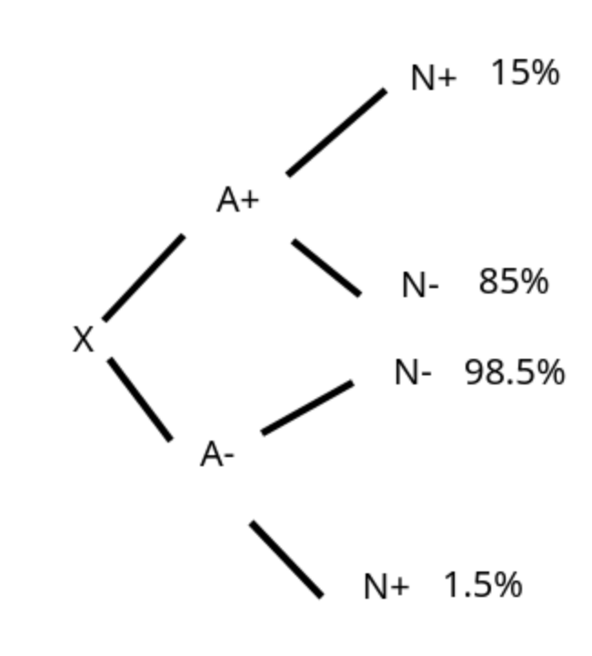

# Příprava prostředí
```{r setup}

C <- function(n, r) {
  factorial(n) / (factorial(n - r) * factorial(r))
}

permutace_opak <- function(vec_n) {
  n <- sum(vec_n)
  res_temp<-factorial(n)
  for(pocet in vec_n) {
    res_temp<-res_temp/factorial(pocet)
  }
  return(res_temp)
}


```

# Úloha 1

> Kolika způsoby lze ze třídy, v níž je 10 dívek a 15 chlapců vybrat pětičlennou skupinu obsahující alespoň 1 dívku a alespoň 1 chlapce?

Počet způsobů lze spočítat jako součet kombinací bez opakování.


```{r}
pocet_zpusobu <-
        C(10, 4) * C(15, 1) +
        C(10, 3) * C(15, 2) +
        C(10, 2) * C(15, 3) +
        C(10, 1) * C(15, 4)


```

Skupiny lze vybrat `r pocet_zpusobu` způsoby.

# Úloha 2

> Kolik existuje anagramů slova KRAKATICE takových, že v nich nejsou 2 stejná písmena těsně za sebou?

Zde se jedná o permutaci všech bez omezení, od níž se následně odečtou možnosti, kdy jsou stejné znaky u sebe


```{r}
vsechny<-c(2,2,1,1,1,1,1)
pismena_vedle_sebe<-c(1,1,1,1,1,1,1)

pocet_zpusobu_anag <- (
        permutace_opak(vsechny)-permutace_opak(pismena_vedle_sebe))
```
Anagramy lze složit `r pocet_zpusobu_anag` způsoby.


# Úloha 3

> Z dopravních statistik vyplývá, že u 15 % řidičů, kteří způsobili dopravní nehodu, bylo prokázáno požití alkoholu. V literatuře se uvádí, že riziko nehody se požitím alkoholu zvyšuje 10x. Na základě uvedených údajů odhadněte, kolik procent řidičů řídí střízlivých.

Ze zadání lzde vyčíst, že těch, co byli pod vlivem alkoholu a zároveň bourali, bylo 15%, z toho vyplývá, že těch, co byli pod vlivem, ale nebourali, bylo 85%.
Další infromací je, že těch, co nejsou pod vlivem, ale bourají, je 10x méně, tím pádem je u A- -> N+ 1.5% a těch, co bourají je tedy dopočet do 100%, tj. 98.5%.
pro lepší znázornění viz Diagram.

{ width=50% }


Žel odhadnout přesné procento se mi z těchto dvou čísel blíže nepovedlo, napadlo mně to zkusit přes vážený průměr daných zastoupení, ale to se nejeví jako správné řešení.


# Úloha 4

> Hladina vody v tankeru je kontrolována pomocí čtyř na sobě nezávislých spínačů stejného typu zapojených dle obrázku. Spínače mají být sepnuty při nízké hladině vody. Je-li hladina vody dostatečná, spínače by měly být vypnuty. Každý ze spínačů je s pravděpodobností 5 % v opačném stavu, než by měl být. Ve chvíli, kdy se propojí uzly A a B (tj. např. sepnou spínače 1 a 4), je vyhlášen poplach.

 1. S jakou pravděpodobností kontrolní systém (viz obrázek) selže a nevyhlásí poplach v případě, že v tankeru je nízká hladina vody?
 2. S jakou pravděpodobností kontrolní systém (viz obrázek) nevyhlásí falešný poplach, tj. poplach v případě, že v tankeru je dostatečná hladina vody?


## Zadání 1

Problém se dá rozložit na dva podproblémy, kde si první paralelní spínače označíme jako $\alpha$ a druhé jako $\beta$. Pak se dá úkol zaspsat jako:

\begin{flalign*}
P(\alpha)=P(S1\cup S2)=1-P(\overline{S1}\cap \overline{S2})=1-(0.95\cdot 0.95)=0.0975 \\
P(\beta)=P(S3\cup S4)=1-P(\overline{S3}\cap\overline{S4})=1-(0.95\cdot0.95)=0.0975 \\
P(\alpha)\cdot P(\beta)=0.0975\cdot0.0975=0.0095
\end{flalign*}


Pravděpodobnost, že systém selže a nevyhlásí poplach v případě nízké hladiny vody je 0.95%.

## Zadání 2

Zde se jedná o doplněk k procentům předešlého příkladu, tj. 100-0.95= 99.05%.
