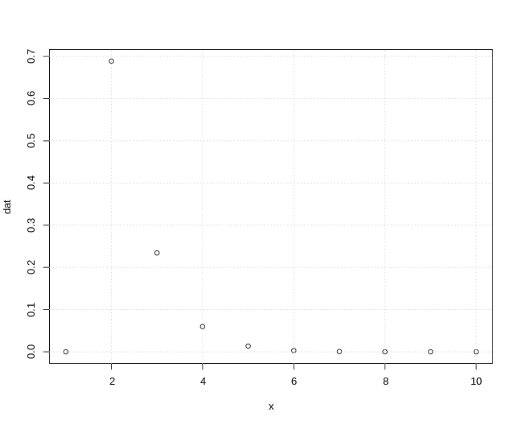
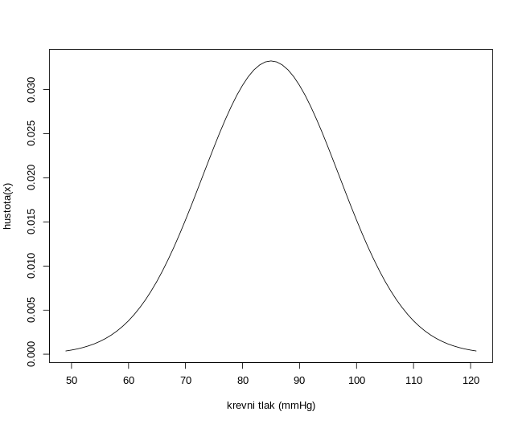
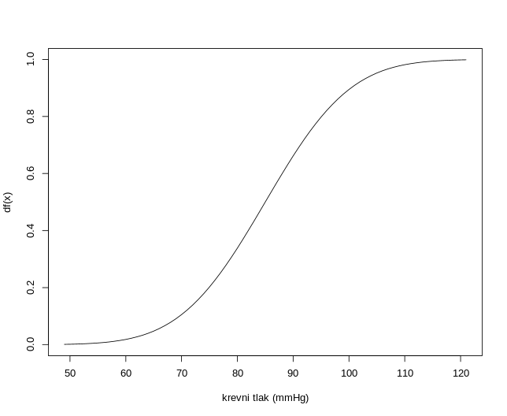
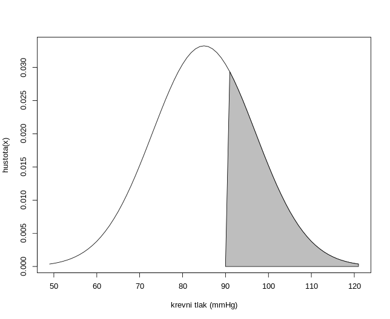
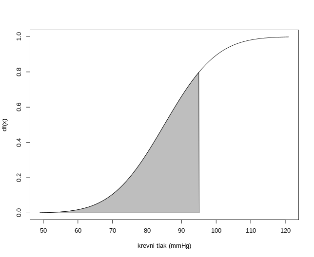

# Úloha 1

> Trenér delfínů ze zkušenosti ví, že jeho milovaný cvičený delfín provede úspěšně artistický kousek s pravděpodobností 0,83 (pokusy delfína o provedení artistického kousku lze považovat za nezávislé). Publiku je slíbeno, že artistický kousek delfína uvidí dvakrát (úspěšně provedené pokusy se mohou střídat s těmi neúspěšnými). Jakmile je úspěšně proveden artistický kousek podruhé, delfín si plave odpočinout a přichází na řadu lachtani.
>
> a) Jaký je očekávaný počet pokusů potřebných k provedení dvou úspěšných artistických kousků?

Zde se snažíme zjisti počet potřebných pokusů do druhého úspěchu. Na tuhle problematiku je vhodné použití negativně binomické pravděpodobnosti.
$$
\begin{aligned}
X &\sim NBi(k; \pi) \\
kde: \\
k &= \text{počet úspěchů} \\
\pi &= \text{pravděpodobnost úspěchu} \\
pak: \\
X &\sim NBi(2; 0.83 ) \\
\end{aligned}
$$

Dle grafu pravdivostní fuknce vyplývá, že na 70% nám budou stačit 2 pokusy na splnění tohoto triku.

> b) Jaká je pravděpodobnost, že delfín bude muset pokus o artistický kousek opakovat více než třikrát, aby byl slib daný publiku splněn?

Zde se snažíme zjistit P(X>3)
což vypočítáme jako 1-P(X<=2)
v R zápisu by se následně jednalo o `1-pnbinom(3-2, 2, 0.83)`
Výsledkem je následně 0.076874

Pravděpodobnost, že bude potřebovat více, než tři pokusy, je 7.67%

> c) Jaká je pravděpodobnost, že delfín bude muset pokus o artistický kousek opakovat alespoň třikrát ale méně než šestkrát, aby byl slib daný publiku splněn?

Zde se snažíme zjistit P(3<=X<6)
což se dá zapsat jako P(X<=5)-P(X<=2)
v R zápisu:`pnbinom(5-2, 2, 0.83) - pnbinom(3-2, 2, 0.83)`

Pravděpodobnost, že bude delfín potřebovat alespoň tři a nanejvýš 6 skoků je 7.32%

> d) Po vystoupení je trenér s delfínem na tréninku, kde jej nechá provést 10 pokusů o provedení artistického kousku. Jaká je pravděpodobnost, že z 10 pokusů bude alespoň polovina úspěšných?

Zde se jedná o pravděpodobnost P(X>5), což se dá přepsat jako 1-P(X<=4).
pak poslouží funkce pbinom(4, 10, 0.83)

Delfínovi se s pravděpodobností 99.73% povede více, než 5 skoků z 10.

# Úloha 2

> V populaci České republiky je 10 % obyvatel Rh negativní (Rh faktor pozitivní/negativní určuje společně se systémem krevních skupin AB0 typ krve člověka). V rámci experimentu pracujeme s 300 obyvateli malé vesničky, kde procentuální zastoupení Rh pozitivních/negativních odpovídá celorepublikovým údajům.

> a) Jaká je pravděpodobnost, že mezi náhodně vybranými 100 lidmi z vesničky bude alespoň 85 lidí Rh pozitivní?

$$
\begin{aligned}
X &\sim Hyp(N;M;n) \\
N &= 300 \\
M &= 300 \cdot 0.9 \\
n &= 100
\end{aligned}
$$

v R zápisu by se jednalo o funkci `1-phyper(84, 300*0.9,300-(300*0.9), 100)`

Pravděpodobnost, že ze 100 vybraných bude alespoń 85 Rh pozitivních, je 98,59%.

> b) Jaká je pravděpodobnost, že mezi náhodně vybranými 100 lidmi z vesničky bude alespoň 90 lidí Rh pozitivní, jestliže už 80 Rh pozitivních ve výběru je?

Zde se jedná o podmíněnou pravděpodobnost hypergeometrického rozdělení.

$$
P(X \geq 90 | X \geq 80) = \frac{P(X \geq 90 \wedge X \geq 80)}{P(X \geq 80)}
$$

$$
\frac{P(X \geq 90)}{P(X \geq 80)} = \frac{1 - P(X \leq 89)}{1 - P(X \leq 79)}
$$

pak při použití gypergeometrického rozdělení `((1-phyper(89, 300 * 0.9, 300-(300 * 0.9), 100)) /(1-phyper(79, 300 * 0.9, 300-(300 * 0.9), 100)))` dodstáváme výsledek 0.5875713.

Pravděpodobnost, že RH pozitivních bude právě maximálně 90, poud jich je aspoň 80, je rovna 58.76%

> c) Jaká je pravděpodobnost, že mezi náhodně vybranými 100 lidmi bude alespoň 85 lidí Rh pozitivní, jestliže tentokrát vybíráme z celé populace ČR?

Zde se jedná o využití binomické věty.
$$
\begin{aligned}
X &\sim Bi(n;\pi) \\
n &= velikost_výběru \\
\pi &= pravděpodobnost_pozitivity
\end{aligned}
$$

v R kódu by výpočet vypadal takto: `1-pbinom(84, 100, 0.9)`

Pravdděpodobnost, že Rh pozitivních bude aspoň 85 je 96.01%.

> d) Určete očekávaný počet Rh pozitivních ze 100 vybraných lidí, kteří byli náhodně vybráni z celé populace ČR.

Ze zadání: "V populaci České republiky je 10 % obyvatel Rh negativní". Z tohoto tvrzení vyplývá, že očekávaný počet pozitivních bude 90.

# Úloha 3

> Při výzkumu bylo sledováno, zda a za jak dlouho od expozice nákazou se nemoc projeví. U probandů, u kterých se nemoc skutečně projevila, lze dobu od expozice do projevu nemoci (dny) modelovat Weibullovým rozdělením s parametrem měřítka 5 a parametrem tvaru 0,7.

> a) Na základě uvedených parametrů rozdělení určete, zda je riziková funkce uvedené náhodné veličiny klesající, konstantní, nebo rostoucí. Rozhodnutí zdůvodněte.

> b) Jaká je pravděpodobnost, že se nemoc projeví po více než 4 dnech od expozice?

> c) Jaká doba od expozice do projevu nemoci bude překročena u 70 % pacientů?

> d) Uplynuly 2 dny od expozice bez projevů nemoci, jaká je pravděpodobnost, že se nemoc projeví během následujícího dne?

# Úloha 4

> Diastolický krevní tlak dospělých má normální rozdělení se střední hodnotou 85 mmHg a směrodatnou odchylkou 12 mmHg.

> a) Načrtněte hustotu pravděpodobnosti uvedené náhodné veličiny a její distribuční funkci.

> b) Kolik procent dospělých má diastolický krevní tlak nad hranicí hypertenze 90 mmHg? Výsledek zaznačte do náčrtku hustoty pravděpodobnosti z bodu a).

Na vypočítání použijeme vzoreček `1-pnorm(90, mean = 85, sd=12)`

Nad hranicí krevního tlaku 90 mmHg je 33.8% dospělé populace.

> c) Určete hodnotu 8. decilu uvedené náhodné veličiny. Zakreslete ji do náčrtku distribuční funkce z bodu a) a slovně ji interpretujte.

8. decil je roven 95.10 mmHg a odpovídá tlaku, který je vyšší než kolik má 80% dospělých jedinců.