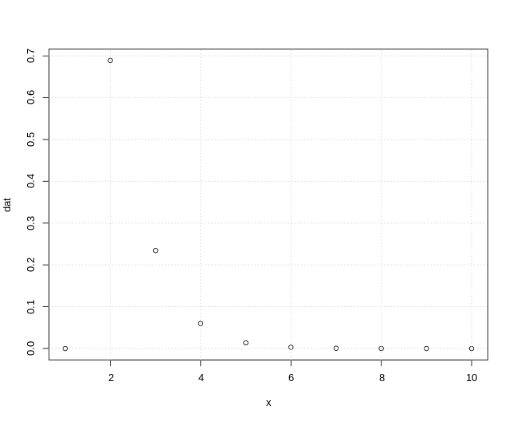

# Úloha 1

> Trenér delfínů ze zkušenosti ví, že jeho milovaný cvičený delfín provede úspěšně artistický kousek s pravděpodobností 0,83 (pokusy delfína o provedení artistického kousku lze považovat za nezávislé). Publiku je slíbeno, že artistický kousek delfína uvidí dvakrát (úspěšně provedené pokusy se mohou střídat s těmi neúspěšnými). Jakmile je úspěšně proveden artistický kousek podruhé, delfín si plave odpočinout a přichází na řadu lachtani.
>
> a) Jaký je očekávaný počet pokusů potřebných k provedení dvou úspěšných artistických kousků?

Zde se snažíme zjisti počet potřebných pokusů do druhého úspěchu. Na tuhle problematiku je vhodné použití negativně binomické pravděpodobnosti.
$$
\begin{aligned}
X &\sim NBi(k; \pi) \\
kde:
k &= \text{počet úspěchů} \\
\pi &= \text{pravděpodobnost úspěchu}
pak:
X &\sim NBi(2; 0.83 ) \\
\end{aligned}
$$

Dle grafu pravdivostní fuknce vyplývá, že na 70% nám budou stačit 2 pokusy na splnění tohoto triku.

>
> b) Jaká je pravděpodobnost, že delfín bude muset pokus o artistický kousek opakovat více než třikrát, aby byl slib daný publiku splněn?
>
> c) Jaká je pravděpodobnost, že delfín bude muset pokus o artistický kousek opakovat alespoň třikrát ale méně než šestkrát, aby byl slib daný publiku splněn?
>
> d) Po vystoupení je trenér s delfínem na tréninku, kde jej nechá provést 10 pokusů o provedení artistického kousku. Jaká je pravděpodobnost, že z 10 pokusů bude alespoň polovina úspěšných?

## Otázka A

Počet potřebných pokůsu do druhého úspěšného provedení triku lze popsat Negativně binomickým rozdělením diskrétní náhodné veličiny.

Za diskrétní veličinu $X$ bereme počet pokusů do k. úspěchu (v našem případě $k=2$) včetně k. úspěchu samotného.

Negativně binomické rozdělení pracuje se dvěma atributy. S požadovaným počtem úspěchů a pravděpodobností úspěchu.

$$
\begin{aligned}
X &\sim NB(k; \pi) \\
k &= \text{počet úspěchů} \\
\pi &= \text{pravděpodobnost úspěchu}
\end{aligned}
$$

Protože počet nutných pokusů nelze určit se 100% přesností, použijeme střední hodnotu veličiny `X`.

$$ E(X) = \frac{k}{\pi} $$

```{r}
k <- 2
pi <- 0.83

stredni_hodnota <- k / pi
pocet_pokusu <- ceiling(stredni_hodnota)
```

Lze očekávat celkově `r pocet_pokusu` pokusy k provedení obou úspěšných kousků.

## Otázka B

Zajímá nás hodnota funkce $P(X > 3)$.

```{r}
x <- 3
k <- 2
pi <- 0.83

# pnbinom nezapočítává do pokusů úspěšné instance
pravdepodobnost_pokusu_nad_3 <-
  pnbinom(x - k, k, pi, lower.tail = FALSE)
```

Pravděpodobnost, že delfín bude muset pokus provést více než třikrát je `r pravdepodobnost_pokusu_nad_3`.

## Otázka C

Zajímá nás hodnota funkce $P(3 \leq X < 6)$.

$$
P(3 \leq X < 6) = P(X < 6) - P(X < 3) = P(X \leq 5) - P(X \leq 2)
$$

```{r}
k <- 2
pi <- 0.83

pravdepodobnost_pokusu_mezi_3_a_6 <-
        pnbinom(5, k, pi) - pnbinom(2, k, pi)
```

Pravděpodobnost, že delfín bude potřebovat alespoň 3 a méně než 6 pokusů je `r pravdepodobnost_pokusu_mezi_3_a_6`.

## Otázka D

Pro úlohu lze využít binomického rozdělení.

$$
\begin{aligned}
X &\sim Bi(n;\pi) \\
n &= \text{počet pokusů} \\
\pi &= \text{pravděpodobnost úspěchu}
\end{aligned}
$$

Zajímá nás hodnota funkce $P(X \geq 5)$. Ta lze spočítat buď pomocí R jako $P(X > 4)$ v kombinaci s `lower.tail=F` nebo jako $1 - P(X \leq 4)$.

```{r}
pravdepodobnost_uspesnosti_nad_5 <- pbinom(4, 10, 0.83, lower.tail = FALSE)
```

Pravděpodobnost, že se delfínovi povede alespoň 5 kousků z 10 je `r pravdepodobnost_uspesnosti_nad_5`.

# Úloha 2

> V populaci České republiky je 10 % obyvatel Rh negativní (Rh faktor pozitivní/negativní určuje společně se systémem krevních skupin AB0 typ krve člověka). V rámci experimentu pracujeme s 300 obyvateli malé vesničky, kde procentuální zastoupení Rh pozitivních/negativních odpovídá celorepublikovým údajům.
>
> a) Jaká je pravděpodobnost, že mezi náhodně vybranými 100 lidmi z vesničky bude alespoň 85 lidí Rh pozitivní? [0,5b]
>
> b) Jaká je pravděpodobnost, že mezi náhodně vybranými 100 lidmi z vesničky bude alespoň 90 lidí Rh pozitivní, jestliže už 80 Rh pozitivních ve výběru je? [0,5b]
>
> c) Jaká je pravděpodobnost, že mezi náhodně vybranými 100 lidmi bude alespoň 85 lidí Rh pozitivní, jestliže tentokrát vybíráme z celé populace ČR? [0,5b]
>
> d) Určete očekávaný počet Rh pozitivních ze 100 vybraných lidí, kteří byli náhodně vybráni z celé populace ČR. [0,5b]

## Otázka A

Lze aplikovat hypergeometrické rozdělení. Jde o výběr bez vracení, kde jednotlivé pokusy jsou závislé. Vybíráme z $N$ prvků, $n$ prvků, přičemž $M$ prvků z $N$ má nějakou sledovanou vlastnost a $(N-M)$ prvků ji nemá.

Sledujeme diskrétní náhodnou veličinu $X$, která popisuje počet Rh pozitivních lidí ze 100 vybraných z celkového počtu obyvatel vesnice.

V našem případě je:

$$
\begin{aligned}
X &\sim H(N;M;n) \\
N &= 300 \\
M &= 300 \cdot 0.9 \\
n &= 100
\end{aligned}
$$

Pravděpodobnost, že mezi náhodně vybranými 100 lidmi z vesničky bude alespoň 85 lidí Rh pozitivních lze popsat funkcí $P(X \geq 85)$. Ta lze přepsat jako $P(X > 84)$, kterou lze v R vypočítat pomocí funkce `phyper` s atributem `lower.tail=F`.

```{r}
# celkový počet obyvatel vesnice
N <- 300
# počet pozitivních ve vesnici
M <- N - (N / 10)
# velikost výběru
n <- 100

pravdepodobnost_pozitivnich_nad_85 <- phyper(84, M, N-M, n, lower.tail = FALSE)
```

Pravděpodobnost, že mezi náhodně vybranými 100 lidmi z vesničky bude alespoň 85 lidí Rh pozitivních, je `r pravdepodobnost_pozitivnich_nad_85`.

## Otázka B

Též příklad na hypergeometrické rozdělení. V tomto případě je nutné aplikovat pravidla pro podmíněnou pravděpodobnost.

$$
P(X \geq 90 | X \geq 80) = \frac{P(X \geq 90 \wedge X \geq 80)}{P(X \geq 80)}
$$

$$
\frac{P(X \geq 90)}{P(X \geq 80)} = \frac{1 - P(X \leq 89)}{1 - P(X \leq 79)} = \frac{P(X > 89)}{P(X > 79)}
$$

```{r}
N <- 300
M <- N * 0.9
n <- 100

pravdepodobnost_pozitivnich_nad_90 <-
        phyper(89, M, N-M, n, lower.tail = FALSE) /
          phyper(79, M, N-M, n, lower.tail = FALSE)
```

Pravděpodobnost, že mezi náhodně vybranými 100 lidmi z vesničky bude alespoň 90 lidí Rh pozitivní, jestliže už 80 Rh pozitivních ve výběru je, je `r pravdepodobnost_pozitivnich_nad_90`.

## Otázka C

`X` je diskrétní náhodnou veličinou popisující počet pozitivních mezi 100 vybraných občanů ČR. Chová se dle binomického rozdělení.

$$
\begin{aligned}
X &\sim Bi(n;\pi) \\
n &= velikost výběru \\
\pi &= pravděpodobnost pozitivity
\end{aligned}
$$

Zajímá nás hodnota funkce $P(X \geq 85)$. Podobně jako u předchozích úloh lze přepsat jako $1 - P(X \leq 84)$ či $P(X > 84)$.

```{r}
n <- 100
pi <- 0.9

pravdepodobnost_pozitivnich_nad_85 <- pbinom(84, n, pi, lower.tail = FALSE)
```

Pravděpodobnost, že mezi náhodně vybranými 100 lidmi bude alespoň 85 lidí Rh pozitivních, jestliže tentokrát vybíráme z celé populace ČR, je `r pravdepodobnost_pozitivnich_nad_85`.

## Otázka D

Počet pozitivních lidí ve výběru je možné odhadnout pomocí střední hodnoty. Parametry rozdělení zůstávají stejné jako u otázky 2c.

$$
E(X) = n \cdot \pi
$$

```{r}
n <- 100
pi <- 0.9

pocet_pozitivnich <- n * pi
```

Ve výběru by bylo přibližně `r pocet_pozitivnich` pozitivních jedinců.

# Úloha 3

>Při výzkumu bylo sledováno, zda a za jak dlouho od expozice nákazou se nemoc projeví. U probandů, u kterých se nemoc skutečně projevila, lze dobu od expozice do projevu nemoci (dny) modelovat Weibullovým rozdělením s parametrem měřítka 5 a parametrem tvaru 0,7.

a) Na základě uvedených parametrů rozdělení určete, zda je riziková funkce uvedené náhodné veličiny klesající, konstantní, nebo rostoucí. Rozhodnutí zdůvodněte. [0,2 b]

b) Jaká je pravděpodobnost, že se nemoc projeví po více než 4 dnech od expozice? [0,3 b]

c) Jaká doba od expozice do projevu nemoci bude překročena u 70 % pacientů? [0,3 b]

d) Uplynuly 2 dny od expozice bez projevů nemoci, jaká je pravděpodobnost, že se nemoc projeví během následujícího dne? [0,7 b]


# Úloha 4

> Diastolický krevní tlak dospělých má normální rozdělení se střední hodnotou 85 mmHg a směrodatnou odchylkou 12 mmHg.
>
> a) Načrtněte hustotu pravděpodobnosti uvedené náhodné veličiny a její distribuční funkci. [0,3b]
>
> b) Kolik procent dospělých má diastolický krevní tlak nad hranicí hypertenze 90 mmHg? Výsledek zaznačte do náčrtku hustoty pravděpodobnosti z bodu a). [0,4b]
>
> c) Určete hodnotu 8. decilu uvedené náhodné veličiny. Zakreslete ji do náčrtku distribuční funkce z bodu a) a slovně ji interpretujte. [0,8b]

## Otázka A

$$
\begin{aligned}
X &\sim N(\mu;\sigma^2) \\
\mu &= \text{střední hodnota} = 85 \\
\sigma &= \text{směrodatná odchylka} = 12
\end{aligned}
$$

```{r}
stredni_hodnota <- 85
smerodatna_odchylka <- 12

funkce_hustoty <- function(x) {
  dnorm(x, mean = stredni_hodnota, sd = smerodatna_odchylka)
}

distribucni_funkce <- function (x) {
  pnorm(x, mean = stredni_hodnota, sd = smerodatna_odchylka)
}

x <- seq(
  from = stredni_hodnota - 3 * smerodatna_odchylka,
  to = stredni_hodnota + 3 * smerodatna_odchylka,
  length = 100
)

plot(x, funkce_hustoty(x),
     type = "l",
     xlab = "krevni tlak (mmHg)",
     ylab = "hustota pravdepodobnosti"
)

plot(x, distribucni_funkce(x),
     type = "l",
     xlab = "krevni tlak (mmHg)",
     ylab = "distribucni funkce"
)
```

## Otázka B

Počítáme hodnotu funkce $P(X > 90)$.

```{r}
y <- funkce_hustoty(x)
plot(x, y,
     type = "l",
     xlab = "krevni tlak (mmHg)",
     ylab = "hustota pravdepodobnosti"
)

polygon(c(90, x[x > 90], max(x)), c(0, y[x > 90], 0), col = "pink")

pravdepodobnost_tlaku_nad_90 <-
  pnorm(90,
        mean = stredni_hodnota,
        sd = smerodatna_odchylka,
        lower.tail = FALSE
  )
```

`r round(pravdepodobnost_tlaku_nad_90 * 100, 3)` % dospělých má diastolický krevní tlak nad hranicí hypertenze 90 mmHg.

## Otázka C

```{r}
y <- distribucni_funkce(x)
plot(x, y,
     type = "l",
     xlab = "krevni tlak (mmHg)",
     ylab = "distribucni funkce"
)

decil_8 <-
  qnorm(0.8,
        mean = stredni_hodnota,
        sd = smerodatna_odchylka
  )

polygon(c(min(x), x[x < decil_8], decil_8),
        c(0, y[x < decil_8], 0),
        col = "pink"
)
```

8. decil je roven `r decil_8` mmHg a odpovídá tlaku, který je vyšší než kolik má 80 % dospělých jedinců.