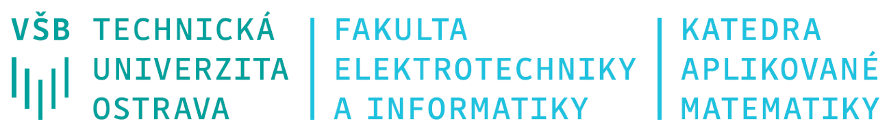

```{=latex}
\begin{center}
\begin{tabular}{| p{.5\textwidth} | p{.5\textwidth}|}
\hline
Jméno studentky/studenta:&  Jindřich Kvita\\
\hline
Osobní číslo: & kvi0029\\
\hline
Jméno cvičící/cvičícího: & Tereza Kovářová\\
\hline
\end{tabular}
\end{center}
```


```{=latex}
\begin{center}
\begin{tabular}{|p{.33\textwidth}|p{.33\textwidth}|p{.33\textwidth}|}
\hline
&Datum odevzdání&Hodnocení\\
\hline
Domácí úkol 1: & & \\
\hline
Domácí úkol 2: & & \\
\hline
Domácí úkol 3: & & \\
\hline
Domácí úkol 4: & & \\
\hline
Celkem: & ----- &\\
\hline
\end{tabular}
\end{center}
```
```{=latex}
\begin{center}
\textbf{Ostrava, AR 2021/2022}
\end{center}
```

```{r setup, include=FALSE}
# install.packages("readxl")
# install.packages("moments")
# install.packages("dplyr")
# install.packages("ggplot2")
# install.packages("ggpubr")

library(readxl)
library(moments)
library(dplyr)
library(ggplot2)
library(ggpubr)


dataA = read_excel("ukol_68.xlsx",
                  sheet = "Amber",
                  skip = 1)
dataA = as.data.frame(dataA)
colnames(dataA)= c("id", "S22", "S5")
dataA$pokles=dataA$S22-dataA$S5

dataB = read_excel("ukol_68.xlsx",
                  sheet = "Bright",
                  skip = 1)
dataB = as.data.frame(dataB)
colnames(dataB)= c("id", "S22", "S5")
dataB$pokles=dataB$S22-dataB$S5
dataA$brand = "Amber"
dataB$brand = "Bright"
data= rbind(dataA, dataB)


OPA = boxplot.stats(data$pokles[data$brand == "Amber"])$out
OPB = boxplot.stats(data$pokles[data$brand == "Bright"])$out
dataOP=rbind(data%>% filter(brand == "Amber" & !(pokles %in% OPA)),
             data %>% filter(brand == "Bright" & !(pokles %in% OPB)))


options(OutDec=",")

roundDown <- function(x, dig) {
  aux <- round(x, digits = dig)
  ifelse(aux <= x, result <- aux, result <- aux - 10^{-dig})
  result
}

roundInterval <- function(x, digits) {
  aux <- roundDown(x[1], digits)
  result <- c(aux, round(tail(x, -1), digits))
  result
}

iDigits <- function(x) {
  sapply(trunc(log10(abs(x)) + 1), function (x) max(1, x))
}

dDigits <- function(x, k = NULL) {
  digits <- if (!is.null(k)) {
    k - iDigits(x)
  } else {
    nchar(abs(x)) - iDigits(x) - 1
  }
  sapply(digits, function(x) max(0, x))
}

sd_signif_digits <- function(size) {
  sapply(size, function (size) {
    if (size <= 10) 1
    else if (size <= 30) 2
    else if (size <= 2000) 3
    else 4
  })
}

sd_decim_digits <- function(sd_, size) {
  k <- sd_signif_digits(size)
  dDigits(sd_, k)
}


```
\newpage

## Popis dtového souboru
Běžné zářivky trpí efektem pomalého nabíhání, tedy plného výkonu dosáhnou až po jisté době provozu.  Toto chování je ovlivněno okolní teplotou, což v praxi znamená, že v chladném prostředí může zářivkám trvat výrazně déle než dosáhnou maximálního výkonu.

Pro test náběhu zářivek na plný světelný výkon bylo vybráno celkem 350 zářivek od čtyř různých výrobců (Amber, Bright, Clear, Dim). Všechny zářivky měly deklarovaný maximální světelný tok 1000 lm. U každé zářivky byl změřen světelný tok po 30 sekundách od zapnutí, nejprve při teplotě 22 °C a poté při teplotě 5°C.

V souboru `ukol_68.xlsx` jsou pro každou z testovaných zářivek uvedeny následující údaje:

* pořadové číslo zářivky,
* výrobce – Amber (A), Bright (B), Clear (C), Dim (D),
* naměřený světelný tok v lumenech při okolní teplotě 5°C,
* naměřený světelný tok v lumenech při okolní teplotě 22°C.

Obecné pokyny:

* Úkoly zpracujte dle obecně známých typografických pravidel.
* Všechny tabulky i obrázky musí být opatřeny titulkem.
* Do úkolů nevkládejte tabulky a obrázky, na něž se v doprovodném textu nebudete odkazovat.
* Bude-li to potřeba, citujte zdroje dle mezinárodně platné citační normy ČSN ISO 690.

\newpage
# Úkol 1
> Pomocí nástrojů explorační analýzy porovnejte pokles světelného toku po 30 sekundách od zapnutí při snížení okolní teploty z 22°C na 5°C u zářivek od výrobců Amber a Bright. Data vhodně graficky prezentujte (krabicový graf, histogram, q-q graf) a doplňte následující tabulky a text.

Výsledky popisné statistiky lze vidět v Tab.  1 a na …...

Tab.  1: Pokles světelného toku po 30 sekundách od zapnutí při snížení okolní teploty z 22°C na 5°C u zářivek od výrobců Amber a Bright (souhrnné statistiky)

```{r, include=FALSE}
vypocti_ukazatele = function (mereni) {
  mereni %>%
    group_by(brand) %>%
    summarise(
      rozsah = length(pokles),
      minimum = min(pokles),
      dolni_kvartil = quantile(pokles, probs = 0.25),
      median = median(pokles),
      prumer = mean(pokles),
      horni_kvartil = quantile(pokles, probs = 0.75),
      maximum = max(pokles),
      smerodatna_odchylka = sd(pokles),
      variacni_koeficient = smerodatna_odchylka / abs(prumer) * 100,
      sikmost = skewness(pokles),
      spicatost = kurtosis(pokles) - 3,
      dolni_mez = dolni_kvartil - 1.5 * IQR(pokles),
      horni_mez = horni_kvartil + 1.5 * IQR(pokles)
    )
}


zaokrouhli_ukazatele <- function (ukazatele, platne_cifry, des_mista, presnost_zdroje) {
  rounded <- data.frame(ukazatele)
  rounded$dolni_kvartil <- formatC(round(rounded$dolni_kvartil, des_mista)+0, des_mista, format = "f")
  rounded$median <- formatC(round(rounded$median, des_mista)+0, des_mista, format = "f")
  rounded$prumer <- formatC(round(rounded$prumer, des_mista)+0, des_mista, format = "f")
  rounded$horni_kvartil <- formatC(round(rounded$horni_kvartil, des_mista)+0, des_mista, format = "f")
  rounded$smerodatna_odchylka <- formatC(signif(rounded$smerodatna_odchylka, platne_cifry)+0, platne_cifry, format = "fg")
  rounded$variacni_koeficient <- formatC(round(rounded$variacni_koeficient, 1)+0, 1, format = "f")
  rounded$sikmost <- formatC(round(rounded$sikmost, 1)+0, 1, format = "f")
  rounded$spicatost <- formatC(round(rounded$spicatost, 1)+0, 1, format = "f")
  rounded$dolni_mez <- formatC(round(rounded$dolni_mez, presnost_zdroje+1)+0, presnost_zdroje+1, format = "f")
  rounded$horni_mez <- formatC(round(rounded$horni_mez, presnost_zdroje+1)+0, presnost_zdroje+1, format = "f")
  rounded
}

nezaokrouhlene_ukazatele <- vypocti_ukazatele(data)
nezaokrouhlene_ukazatele_bez_op <- vypocti_ukazatele(dataOP)

ukazatele <- zaokrouhli_ukazatele(
  nezaokrouhlene_ukazatele,
  platne_cifry = sd_signif_digits(nezaokrouhlene_ukazatele$rozsah),
  des_mista = sd_decim_digits(nezaokrouhlene_ukazatele$smerodatna_odchylka, nezaokrouhlene_ukazatele$rozsah),
  presnost_zdroje = 1
)
ukazatele_bez_op <- zaokrouhli_ukazatele(
  nezaokrouhlene_ukazatele_bez_op,
  platne_cifry = sd_signif_digits(nezaokrouhlene_ukazatele_bez_op$rozsah),
  des_mista = sd_decim_digits(nezaokrouhlene_ukazatele_bez_op$smerodatna_odchylka, nezaokrouhlene_ukazatele_bez_op$rozsah),
  presnost_zdroje = 1
)

```
\begin{table}[h]
    \begin{tabular}{|l|c|c||c|c|}
        \hline
            & \multicolumn{2}{c||}{\textbf{Původní data}} & \multicolumn{2}{c|}{\textbf{Data bez odlehlých pozorování}} \\
        \hline
            & \textbf{Amber}
            & \textbf{Bright}
            & \textbf{Amber}
            & \textbf{Bright} \\
        \hline
        \hline
            \textbf{rozsah souboru}
            &`r ukazatele$rozsah[1]`
            &`r ukazatele$rozsah[2]`
            &`r ukazatele_bez_op$rozsah[1]`
            &`r ukazatele_bez_op$rozsah[2]` \\
        \hline
            \textbf{minimum}
            &`r ukazatele$minimum[1]`
            &`r ukazatele$minimum[2]`
            &`r ukazatele_bez_op$minimum[1]`
            &`r ukazatele_bez_op$minimum[2]` \\
        \hline
            \textbf{dolní kvartil}
            &`r ukazatele$dolni_kvartil[1]`
            &`r ukazatele$dolni_kvartil[2]`
            &`r ukazatele_bez_op$dolni_kvartil[1]`
            &`r ukazatele_bez_op$dolni_kvartil[2]` \\
        \hline
            \textbf{medián}
            &`r ukazatele$median[1]`
            &`r ukazatele$median[2]`
            &`r ukazatele_bez_op$median[1]`
            &`r ukazatele_bez_op$median[2]` \\
        \hline
            \textbf{průměr}
            &`r ukazatele$prumer[1]`
            &`r ukazatele$prumer[2]`
            &`r ukazatele_bez_op$prumer[1]`
            &`r ukazatele_bez_op$prumer[2]` \\
        \hline
            \textbf{horní kvartil}
            &`r ukazatele$horni_kvartil[1]`
            &`r ukazatele$horni_kvartil[2]`
            &`r ukazatele_bez_op$horni_kvartil[1]`
            &`r ukazatele_bez_op$horni_kvartil[2]` \\
        \hline
            \textbf{maximum}
            &`r ukazatele$maximum[1]`
            &`r ukazatele$maximum[2]`
            &`r ukazatele_bez_op$maximum[1]`
            &`r ukazatele_bez_op$maximum[2]` \\
        \hline
        \hline
            \textbf{směrodatná odchylka}
            &`r ukazatele$smerodatna_odchylka[1]`
            &`r ukazatele$smerodatna_odchylka[2]`
            &`r ukazatele_bez_op$smerodatna_odchylka[1]`
            &`r ukazatele_bez_op$smerodatna_odchylka[2]` \\
        \hline
            \textbf{variační koeficient (\%)}
            &`r ukazatele$variacni_koeficient[1]`
            &`r ukazatele$variacni_koeficient[2]`
            &`r ukazatele_bez_op$variacni_koeficient[1]`
            &`r ukazatele_bez_op$variacni_koeficient[2]` \\
        \hline
        \hline
            \textbf{šikmost}
            &`r ukazatele$sikmost[1]`
            &`r ukazatele$sikmost[2]`
            &`r ukazatele_bez_op$sikmost[1]`
            &`r ukazatele_bez_op$sikmost[2]` \\
        \hline
            \textbf{špičatost}
            &`r ukazatele$spicatost[1]`
            &`r ukazatele$spicatost[2]`
            &`r ukazatele_bez_op$spicatost[1]`
            &`r ukazatele_bez_op$spicatost[2]` \\
        \hline
        \hline
            \multicolumn{5}{|l|}{\textbf{Identifikace odlehlých pozorování (vnitřní hradby)}}\\
        \hline
        \hline
            \textbf{dolní mez}
            &`r ukazatele$dolni_mez[1]`
            &`r ukazatele$dolni_mez[2]`
            & \multicolumn{2}{c|}{} \\
        \hline
            \textbf{horní mez}
            &`r ukazatele$horni_mez[1]`
            &`r ukazatele$horni_mez[2]`
            & \multicolumn{2}{c|}{} \\
        \hline
    \end{tabular}
\caption{Pokles světelného toku po 30 sekundách od zapnutí při snížení okolní teploty z 22°C na 5°C u zářivek od výrobců Amber a Bright (souhrnné statistiky)}
\end{table}
## Grafická prezentace (krabicový graf, histogram, q-q graf):
```{r, include=FALSE, results = FALSE}
krabicovy_graf <- ggplot(data,
                         aes(x = brand,
                             y = pokles))+
  stat_boxplot(geom = "errorbar",
               width = 0.15)+
  geom_boxplot()+
  labs(x = "", y = "Pokles světelného toku (lm)", caption = "(data z původního datasetu)")

krabicovy_graf_bez_op <- ggplot(dataOP,
                                aes(x = brand,
                                    y = pokles))+
  stat_boxplot(geom = "errorbar",
               width = 0.15)+
  geom_boxplot()+
  labs(x = "",
       y = "Pokles světelného toku (lm)",
       caption = "(data bez odlehlých pozorování)")

histogram_bez_op <- ggplot(dataOP,
                           aes(x = pokles))+
  geom_histogram(aes(y = ..density..),
                 binwidth = 0.6,
                 color = "black",
                 fill = "grey55")+
  geom_density()+
  labs(x = "Pokles světelného toku (lm)",
       y = "Hustota pravděpodobnosti")+
  facet_wrap("brand",
             dir = "v")

qq_graf_bez_op <- ggplot(dataOP,
                         aes(sample = pokles))+
  stat_qq()+
  stat_qq_line()+
  labs(x = "Teoretické normované kvantily", y = "Výběrové kvantily")+
  facet_wrap("brand",
             ncol = 2,
             scales = "free")
shapiro.test(dataOP$pokles[data$brand == "Amber"])
shapiro.test(dataOP$pokles[data$brand == "Bright"])
```
```{r, echo = FALSE, fig.cap = "Pokles světelného toku zářivek (lm) Amber a Bright (histogram / Q-Q graf)"}
ggarrange(histogram_bez_op, qq_graf_bez_op, ncol = 1, nrow = 2)
```
```{r, echo = FALSE, fig.cap = "Pokles světelného toku (lm) zářivek Amber a Bright (krabicový graf)", fig.height = 5}
ggarrange(krabicovy_graf, krabicovy_graf_bez_op, ncol = 1, nrow = 2)
```


\newpage
```{r, echo = FALSE, results = FALSE}
index_odlehleho_pozorovani_amber <- data$index[data$pokles %in% OPA]
index_odlehleho_pozorovani_bright <- data$index[data$pokles %in% OPB]
```
```{=latex}
\begin{minipage}{\textwidth}
```
**Analýza poklesu světelného toku zářivek výrobce Bright
(po 30 sekundách od zapnutí, při snížení okolní teploty z 22°C na 5°C)**

Během testu byl zjišťován pokles světelného toku `r ukazatele$rozsah[2]` kusů zářivek výrobce Bright. Zjištěný pokles se pohyboval v rozmezí `r ukazatele$minimum[2]` lm až `r ukazatele$maximum[2]` lm. Pokles světelného toku zářivek č. `r index_odlehleho_pozorovani_bright` byl na základě metody vnitřních hradeb identifikován jako odlehlé pozorování a nebude zahrnut do dalšího zpracování. Možné příčiny vzniku odlehlých pozorování jsou: chyba měření, výjimečná vada zářivky, chyba zpracování dat. Dále uvedené výsledky tedy pocházejí z analýzy poklesů světelného toku `r ukazatele_bez_op$rozsah[2]` kusů zářivek. Jejich průměrný pokles světelného toku byl `r ukazatele_bez_op$prumer[2]` lm, směrodatná odchylka pak `r ukazatele_bez_op$smerodatna_odchylka[2]` lm. U poloviny testovaných zářivek pokles světelného toku nepřekročil `r ukazatele_bez_op$median[2]` lm. V polovině případů se pokles světelného toku pohyboval v rozmezí `r ukazatele_bez_op$dolni_kvartil[2]` lm až `r ukazatele_bez_op$horni_kvartil[2]` lm. Vzhledem k příliš vysoké hodnotě variačního koeficientu (`r ukazatele_bez_op$variacni_koeficient[2]` %) není variační koeficient, v tomto případě, vhodný ukazatel homogenity souboru.

```{=latex}
\end{minipage}
```

```{r, echo = FALSE, include = FALSE}
dolni_mez_75_bez_op <- nezaokrouhlene_ukazatele_bez_op$prumer - 2 * nezaokrouhlene_ukazatele_bez_op$smerodatna_odchylka
horni_mez_75_bez_op <- nezaokrouhlene_ukazatele_bez_op$prumer + 2 * nezaokrouhlene_ukazatele_bez_op$smerodatna_odchylka

des_mista_bez_op <- sd_decim_digits(nezaokrouhlene_ukazatele_bez_op$smerodatna_odchylka, nezaokrouhlene_ukazatele_bez_op$rozsah)
des_mista_bez_op <- round(mean(des_mista_bez_op), 0)

dolni_mez_75_bez_op_f <- formatC(
  roundDown(dolni_mez_75_bez_op, des_mista_bez_op)+0,
  des_mista_bez_op,
  format = "f")
horni_mez_75_bez_op_f <- formatC(
  round(horni_mez_75_bez_op, des_mista_bez_op)+0,
  des_mista_bez_op,
  format = "f")
```


```{=latex}
\begin{minipage}{\textwidth}
```
**Ověření normality poklesu světelného toku zářivek výrobce Amber
(po 30 sekundách od zapnutí, při snížení okolní teploty z 22°C na 5°C)**


Na základě grafického zobrazení (viz Obrázek 1) a výběrové šikmosti a špičatosti (výběrová šikmost i špičatost leží  v intervalu ) lze předpokládat, že pokles světelného toku zářivek výrobce Amber má normální rozdělení. Dle pČebyševovy nerovnosti lze tedy očekávat, že přibližně více než 75 % zářivek bude mít pokles světelného toku v rozmezí `r dolni_mez_75_bez_op_f[1]` lm až `r horni_mez_75_bez_op_f[1]` lm.

```{=latex}
\end{minipage}
```

```{=latex}
\begin{minipage}{\textwidth}
```
**Ověření normality poklesu světelného toku zářivek výrobce Bright
(po 30 sekundách od zapnutí, při snížení okolní teploty z 22°C na 5°C)**

Na základě grafického zobrazení (viz Obrázek 1) a výběrové šikmosti a špičatosti (výběrová šikmost i špičatost leží  v intervalu ) nelze předpokládat, že pokles světelného toku zářivek výrobce Bright má normální rozdělení. Dle Čebyševovy nerovnosti lze tedy očekávat, že přibližně Více než 75 % zářivek bude mít pokles světelného toku v rozmezí `r dolni_mez_75_bez_op_f[2]` lm až `r horni_mez_75_bez_op_f[2]` lm.
```{=latex}
\end{minipage}
```

\newpage
# Úkol 2
Porovnejte pokles světelného toku po 30 sekundách od zapnutí při snížení okolní teploty z  22°C na  5°C u  zářivek od výrobců Amber a Bright. Nezapomeňte, že použité metody mohou vyžadovat splnění určitých předpokladů. Pokud tomu tak bude, okomentujte splnění/nesplnění těchto předpokladů jak na základě explorační analýzy (např. s  odkazem na histogram apod.), tak exaktně pomocí metod statistické indukce.

a) Graficky prezentujte srovnání poklesů světelného toku zářivek výrobců Amber a Bright při snížení okolní teploty (vícenásobný krabicový graf, histogramy, q-q grafy). Srovnání okomentujte (včetně informace o případné manipulaci s  datovým souborem). Poznámka: Byla-li grafická prezentace poklesů světelných toků v  úkolů 1 bez připomínek, stačí do komentáře vložit odkaz na grafické výstupy z  úkolu 1.

    Při porovnání dat po odstranění odlehlých pozorování (v obou případěch se jednalo o odstranění jedné hodnoty) se jeví data u výrobce Amber, že mají normální rozdělení, avšak data u výrobce Bright, dle historgram u (obrázek 1) a vychýlení na gg grafu (obrázek 2), že se nebude jednat o normální rozdělení. Dle krabicového grafu lze usuzovat, že rozptyl u výrobce Bright bude menší, tudíž budou konzistentnější. Takto bylo usouzeno dle faktu, že je jak krabice, tak fousy u výrobce Bright menší)
b) Na hladině významnosti 5 % rozhodněte, zda jsou střední poklesy (popř. mediány poklesů) světelného toku zářivek výrobců Amber a Bright statisticky významné. K  řešení využijte bodové a  intervalové odhady i testování hypotéz. Výsledky okomentujte.
```{r, include = FALSE}
library(lawstat)

shapiro_results <- tapply(dataOP$pokles, dataOP$brand, shapiro.test)
symmetry_results <- tapply(dataOP$pokles, dataOP$brand, symmetry.test, boot = FALSE)

shapiro_p_f <- lapply(
  shapiro_results,
  function(x) format.pval(round(x$p.value, digits = 3), eps = 0.001))
symmetry_p_f <- lapply(
  symmetry_results,
  function(x) format.pval(round(x$p.value, digits = 3), eps = 0.001))
```
\begin{table}[h]
    \centering
    \begin{tabular}{|l|c|c|c|c|}
    \hline
    & šikmost & špičatost & \makecell{Shapiro-Wilkův test \\ (p-hodnota)} & \makecell{test symetrie \\ (p-hodnota)} \\ \hline
    Amber
        &`r ukazatele_bez_op$sikmost[1]`
        &`r ukazatele_bez_op$spicatost[1]`
        &`r shapiro_p_f[1]`
        &`r symmetry_p_f[1]` \\
    \hline
    Bright
        &`r ukazatele_bez_op$sikmost[2]`
        &`r ukazatele_bez_op$spicatost[2]`
        &`r shapiro_p_f[2]`
        &`r symmetry_p_f[2]` \\
    \hline
    \end{tabular}
    \caption{Ověření normality a symetrie poklesu světelného toku zářivek dle výrobce}
\end{table}

Dle Shapiro-Wilkova testu, u  výrobce Amber, na hladině významnosti 5% normalitu nezamítáme. U výrobce Bright ji na stejné hladině významnosti zamítáme. Z tohoto důvodu (a aby bylo možné dále výrobce mezi sebou poronávat), bude u obou výrobců využito neparametrických testů.

Dále byl použit levostranný intervalový oddhat a test významnosti mediánů pro oba výrobce. Test významnosti byl proveden pomocí Wilcoxonova testu.

```{r, include = FALSE}
median_results <- tapply(dataOP$pokles, dataOP$brand, median, 0.5)
wilcox_results <- tapply(dataOP$pokles, dataOP$brand, wilcox.test, alternative = "greater", conf.int = T, mu = 0)
wilcox_int <- lapply(wilcox_results, function(x) x$conf.int[1])

des_mista <- sd_decim_digits(nezaokrouhlene_ukazatele_bez_op$smerodatna_odchylka, nezaokrouhlene_ukazatele_bez_op$rozsah)

median_f <- format(median_results, nsmall = des_mista, digits = des_mista)

wilcox_int_f <- NULL
wilcox_int_f$Amber <- roundDown(wilcox_results$Amber$conf.int, des_mista[1])
wilcox_int_f$Bright <- roundDown(wilcox_results$Bright$conf.int, des_mista[2])

wilcox_p_f <- lapply(
  wilcox_results,
  function(x) format.pval(round(x$p.value, digits = 3)+0, eps = 0.001))
```

\begin{table}[h]
    \centering
        \begin{tabular}{|l|c|c|c|}
        \hline
        & \makecell{bodový odhad \\ (lm)}
        & \makecell{95\% levostranný IO \\ (lm)}
        & \makecell{Wilcoxonův levostranný test \\ (p-hodnota)} \\ \hline
        Amber
            & `r median_f[1]`
            & (`r wilcox_int_f$Amber[1]`; +\infty)
            & `r wilcox_p_f$Amber` \\ \hline
        Bright
            & `r median_f[2]`
            & (`r wilcox_int_f$Bright[1]`; +\infty)
            & `r wilcox_p_f$Bright` \\ \hline
        \end{tabular}
    \caption{Odhad mediánu poklesu světelného toku (lm) dle výrobce a test významnosti poklesu toku}
    \label{tab:2b-int-wilcox}
\end{table}

U výrobce Amber je pokles svitu u poloviny zářivek větší, než `r median_f[1]` lm. 95% levostranný intervalový odhad mediánu poklesu je (`r wilcox_int_f$Amber[1]`; +\infty) lm. Na hladině významnosti 0,05 jsou poklesy svitu statisticky významné, protože se bodový odhad náleží intervalu (`r wilcox_int_f$Amber[1]`; +\infty). Obrodbná situace je i u výrobce Bright, jen s rozdílem, že polovina poklesů svitu je větší, než `r median_f[2]` lm a 95% levostranný intervalový odohad mediánu poklesu je (`r wilcox_int_f$Bright[1]`; +\infty)


c) Na hladině významnosti 5 % rozhodněte, zda je rozdíl středních hodnot (mediánů) poklesů světelných toků zářivek výrobců Amber a Bright (při snížení okolní teploty) statisticky významný. K  řešení využijte bodový a intervalový odhad i čistý test významnosti. Výsledky okomentujte.

```{r, include = FALSE}
diff_mannwh_results <- wilcox.test(dataOP$pokles[dataOP$brand == "Amber"], dataOP$pokles[dataOP$brand == "Bright"], conf.int = T, alternative = "two.sided", mu = 0)

des_mista <- sd_decim_digits(nezaokrouhlene_ukazatele_bez_op$smerodatna_odchylka, nezaokrouhlene_ukazatele_bez_op$rozsah)
des_mista <- round(mean(des_mista), digits = 0)

diff_mannwh_results_int_rounded <- formatC(
  roundInterval(diff_mannwh_results$conf.int, des_mista)+0, des_mista, format = "f")
diff_mannwh_results_p_rounded <- format.pval(
  round(diff_mannwh_results$p.value, 3)+0, digits = 3, eps = 0.001)[1]
diff_median <- formatC(
  round(nezaokrouhlene_ukazatele_bez_op$median[1] - nezaokrouhlene_ukazatele_bez_op$median[2], des_mista), des_mista, format = "f")[1]
```

Tvar rozdělení poklesů toků u Amber je normální avšak u Bright ne. Kvůli tomu je nutno použít neparametrické testy pro oba výrovbe, budou tedy použity metody založené na Mannově-Whitneyho statistice.

\begin{table}[h]
    \centering
    \begin{tabular}{|l|c|c|c|}
    \hline
    & \makecell{bodový odhad \\ (lm)}
    & \makecell{95\% oboustranný \\ IO (lm)}
    & \makecell{Mannův-Whitneyho \\ oboustranný test \\ (p-hodnota)} \\ \hline
    Amber - Bright
        & `r diff_median`
        & (`r diff_mannwh_results_int_rounded[1]`; `r diff_mannwh_results_int_rounded[2]`)
        & `r diff_mannwh_results_p_rounded` \\ \hline
    \end{tabular}
    \caption{Odhad rozdílu mediánu poklesu světelného toku (lm) dle výrobce \mbox{a test} významnosti rozdílu mediánu}
    \label{tab:2c-int-wilcox}
\end{table}

Dle bodového odhadu mediánu poklesu světelného toku očekávám pokles toku u zářivek výrobce Amber o cca `r diff_median` lm než u zářivek Bright. Tomu odpovídá i 95% oboustranný intervalový odhad tohoto rozdílu, dle kterého interval \mbox{(`r diff_mannwh_results_int_rounded[1]`; `r diff_mannwh_results_int_rounded[2]`)} pokrývá skutečný rozdíl mediánů s 95% pravděpodobností.

\newpage

# Úkol 3
Na hladině významnosti 5 % rozhodněte, zda se světelný tok zářivek při teplotě 5 °C liší v závislosti na tom, od kterého výrobce pocházejí. Posouzení proveďte nejprve na základě explorační analýzy a následně pomocí vhodného statistického testu, včetně ověření potřebných předpokladů. V případě, že se světelný tok zářivek jednotlivých výrobců statisticky významně liší, určete pořadí výrobců dle středního světelného toku (popř. mediánu světelného toku) zářivek při 5°C.

a) Daný problém vhodným způsobem graficky prezentujte (vícenásobný krabicový graf, histogramy, q-q grafy). Srovnání okomentujte (včetně informace o případné manipulaci s datovým souborem).

b) Ověřte normalitu a symetrii světelného toku zářivek při teplotě 5°C u všech čtyř výrobců (empiricky i exaktně).

c) Ověřte homoskedasticitu (shodu rozptylů) světelného toku zářivek při teplotě 5 °C jednotlivých výrobců (empiricky i exaktně).

d) Určete bodové a 95% intervalové odhady střední hodnoty (popř. mediánu) světelného toku zářivek při teplotě 5°C pro všechny srovnávané výrobce. (Nezapomeňte na ověření předpokladů pro použití příslušných intervalových odhadů.)

e) Čistým testem významnosti ověřte, zda je pozorovaný rozdíl středních hodnot (popř. mediánů) světelného toku zářivek při teplotě 5°C statisticky významný na hladině významnosti 5 %. Pokud ano, zjistěte, zda lze některé skupiny výrobců označit (z hlediska světelného toku zářivek po 30 sekundách od zapnutí, při teplotě 5°C) za homogenní, tj. určete pořadí výrobců dle středních hodnot (popř. mediánů) světelného toku zářivek při 5°C. (Nezapomeňte na ověření předpokladů pro použití zvoleného testu.)

\newpage

# Úkol 4
Všichni čtyři výrobci udávají, že jejich zářivky dosáhnou při 5°C po 30 sekundách od zapnutí alespoň osmdesáti procent deklarovaného maximálního světelného toku (tj. 80 % z 1 000 lm). Definujte si novou dichotomickou proměnnou Splnění požadavku na deklarovaný světelný tok po 30 s (při 5°C), která bude nabývat hodnot {ANO, NE}.  Poznámka: Pracujte s původními daty, nikoliv s daty po odstranění odlehlých pozorování.

a) Srovnejte zářivky jednotlivých výrobců dle toho, zda při teplotě 5°C splňují deklarovaný světelný tok po 30 s od zapnutí pro jednotlivé výrobce (Amber, Bright, Clear, Dim). Výsledky prezentujte pomocí kontingenční tabulky, vhodného grafu a vhodné míry kontingence. Vaše úsudky komentujte.

b) V případě výrobce Bright určete bodový i 95% intervalový odhad pravděpodobnosti, že při teplotě 5°C zářivka nedosáhne po 30 sekundách požadovaného světelného toku (80 % deklarovaného maximálního světelného toku). Nezapomeňte na ověření předpokladů pro použití intervalového odhadu.

c) Určete bodový i 95% intervalový odhad relativního rizika, že zářivka při teplotě 5°C nedosáhne po 30 sekundách požadovaného světelného toku (80 % deklarovaného maximálního světelného toku), pro „nejhoršího“ výrobce (vzhledem k „nejlepšímu“ výrobci). Výsledky slovně interpretujte.

d) Určete bodový i 95% intervalový odhad poměru šancí, že zářivka při teplotě 5°C nedosáhne po 30 sekundách požadovaného světelného toku (80 % deklarovaného maximálního světelného toku), pro „nejhoršího“ výrobce (vzhledem k „nejlepšímu“ výrobci). Výsledky slovně interpretujte.

e) Pomocí chí-kvadrát testu nezávislosti rozhodněte, jestli to, že zářivka při teplotě 5°C nedosáhne po 30 sekundách požadovaného světelného toku (80 % deklarovaného maximálního světelného toku), závisí statisticky významně na tom, od kterého výrobce zářivka pochází. Výsledky okomentujte.

\newpage

## Jak identifikovat, zda jsou v datech odlehlá pozorování?
### Emiprické posouzení:
* použití vnitřních (vnějších) hradeb,
* vizuální posouzení krabicového grafu.
Jak naložit s odlehlými hodnotami by měl definovat hlavně zadavatel analýzy (expert na danou problematiku).

## Jak ověřit normalitu dat?
#### Emiprické posouzení:
* vizuální posouzení histogramu,
* vizuální posouzení grafu odhadu hustoty pravděpodobnosti,
* Q-Q graf,
* posouzení výběrové šikmosti a výběrové špičatosti.

#### Exaktní posouzení:
* testy normality (např. Shapirův – Wilkův test, Andersonův-Darlingův test, Lillieforsův test, …)

## Jak ověřit homoskedasticitu (shodu rozptylů)?
#### Emiprické posouzení:
* poměr největšího a nejmenšího rozptylu,
* vizuální posouzení krabicového grafu.

### Exaktní posouzení:
* F – test (parametrický dvouvýběrový test),
* Bartlettův test (parametrický vícevýběrový test),
* Leveneův test (neparametrický test).
